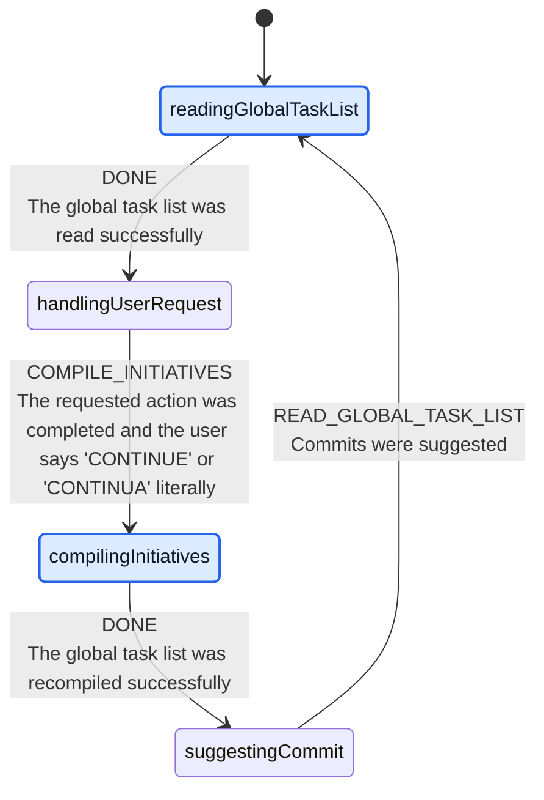

# manage-tasks v1.0

```mermaid
stateDiagram-v2

    [*] --> readingGlobalTaskList

    readingGlobalTaskList --> handlingUserRequest: DONE<br/>The global task list was read successfully

    handlingUserRequest --> compilingInitiatives: COMPILE_INITIATIVES<br/>The requested action was completed and the user says 'CONTINUE' or 'CONTINUA' literally

    compilingInitiatives --> suggestingCommit: DONE<br/>The global task list was recompiled successfully

    suggestingCommit --> readingGlobalTaskList: READ_GLOBAL_TASK_LIST<br/>Commits were suggested

    classDef scriptState fill:#DCEBFF,stroke:#2563EB,stroke-width:2px,color:#111827
    classDef switchState fill:#FEE2E2,stroke:#DC2626,stroke-width:2px,color:#111827

    class readingGlobalTaskList,compilingInitiatives scriptState
```
