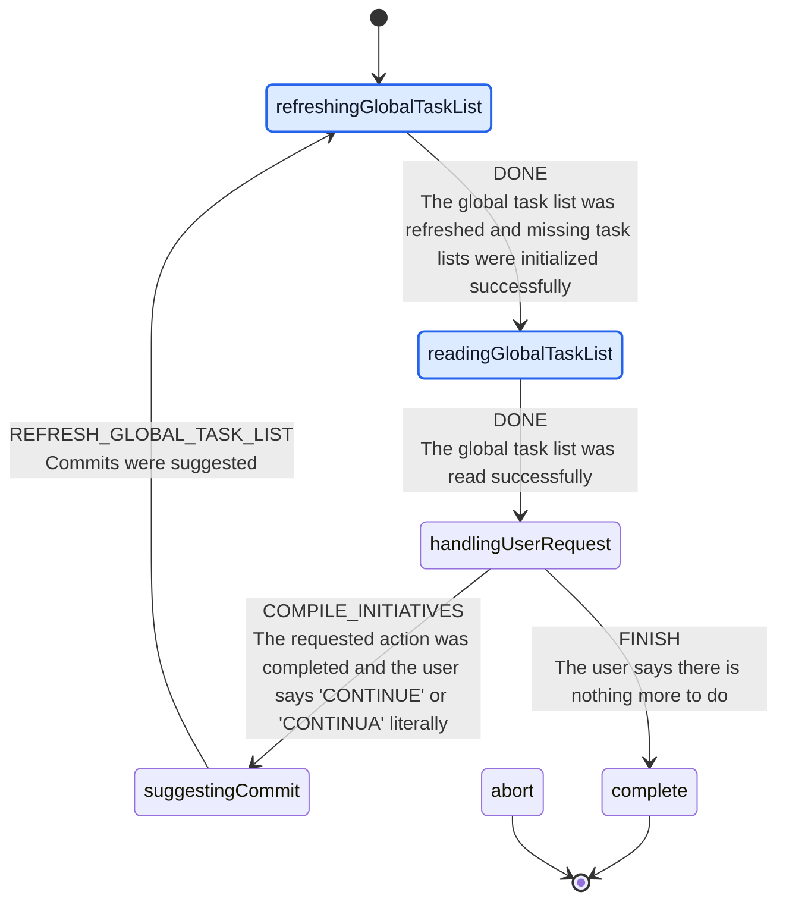

# manage-tasks v1.0

```mermaid
stateDiagram-v2

    [*] --> refreshingGlobalTaskList

    refreshingGlobalTaskList --> readingGlobalTaskList: DONE<br/>The global task list was refreshed and missing task lists were initialized successfully

    readingGlobalTaskList --> handlingUserRequest: DONE<br/>The global task list was read successfully

    handlingUserRequest --> suggestingCommit: COMPILE_INITIATIVES<br/>The requested action was completed and the user says 'CONTINUE' or 'CONTINUA' literally
    handlingUserRequest --> complete: FINISH<br/>The user says there is nothing more to do

    suggestingCommit --> refreshingGlobalTaskList: REFRESH_GLOBAL_TASK_LIST<br/>Commits were suggested

    complete --> [*]
    abort --> [*]

    classDef scriptState fill:#DCEBFF,stroke:#2563EB,stroke-width:2px,color:#111827
    classDef switchState fill:#FEE2E2,stroke:#DC2626,stroke-width:2px,color:#111827
    classDef spawnState fill:#FEF3C7,stroke:#D97706,stroke-width:2px,color:#111827

    class refreshingGlobalTaskList,readingGlobalTaskList scriptState
```
