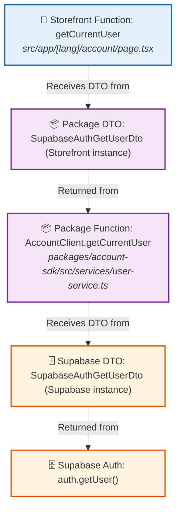

# Define Journey Use Case DTOs

## Objective

The job MUST define the backend-facing response DTOs required by one or more use cases in a journey.

The job MUST derive DTOs from backend resources and capabilities that actually exist in Medusa, Supabase, or internal package SDKs (`packages/*`).

The job MUST produce a Project Output for the TypeScript contract file (`[journey].contract.ts`) and a Managed Output for the Mermaid data-flow graph document.

The job MUST NOT implement frontend services, repositories, use cases, actions, pages, or components.

## Inputs

The job MUST receive:

- one journey identifier;
- one or more use case identifiers.

Each journey identifier MUST contain lowercase words separated by hyphens. Use cases MUST be specified in camelCase.

The job MAY receive:

- **Previous Managed Output Context**: The existing Mermaid data-flow graph from previous job executions in the journey domain, already present in the execution context.

When executing in the context of an existing journey domain with previous graph context available, the agent MUST preserve all pre-existing diagram flows and append the new use case flows to the Mermaid graph in the new managed output document. If no previous graph context is present, the agent MUST generate a fresh managed output document.

The agent MUST discover the backend operations, resource shapes, DTO boundaries, and source locations required by the selected use cases. The agent MUST inspect relevant existing Storefront implementations and Package SDKs to identify callers, operations, and consumed response shapes. Frontend evidence MUST inform the analysis but MUST NOT override the actual backend contract.

Examples:

```txt
Journey: account
Use cases:
- getCurrentUser
```

```txt
Journey: account
Use cases:
- updateProfile
- getLoyaltyRewards
```

## Scope

The agent MAY inspect:

```txt
apps/storefront/
packages/
apis/[journey]/
```

The agent MAY modify:

```txt
apis/[journey]/domain/contracts/[journey].contract.ts
```

The agent MUST NOT modify the following unless the user explicitly requests it:

```txt
apps/storefront/
packages/
```

## Process

**1. Resolve backend capabilities & integration layers**

1. The agent MUST inspect Medusa for every selected use case (`GET`, `POST`, custom plugin routes).
2. The agent MUST inspect established Supabase tables/Auth and internal package SDKs (`packages/*`) to discover all relevant backend capabilities and DTO shapes.
3. The agent MUST identify the concrete operation, query, route, module, or resource that supplies each required field.
4. The agent MUST inspect relevant existing Storefront components/hooks and Package SDKs to identify caller file paths and consumed response shapes.
5. The agent MUST NOT present unsupported fields, relations, operations, or guarantees as capabilities already provided by the backend.

**2. Classify DTOs & define contract boundaries**

1. The agent MUST categorize response DTOs into four primary source categories:
   - **`1. MEDUSA ROUTE DTOs`**: Raw DTOs exposed directly by Medusa core or plugin store routes (e.g., `MedusaCustomerGetRouteDto`).
   - **`2. PACKAGE DTOs`**: Domain response DTOs exposed by internal SDK packages (`packages/*`) (e.g., `AccountUserDto`).
   - **`3. PACKAGE DTOs -> Supabase DTOs`**: Response DTO shapes resulting from implicit database queries or Auth calls executed inside package functions against Supabase (e.g., `SupabaseAuthGetUserDto`).
   - **`4. STOREFRONT -> Supabase DTOs`**: Supabase DTO shapes consumed directly within Storefront components/hooks (e.g., `UserProfileSupabaseDto`).
2. **Canonical DTO Rule (Single Contract Type)**:
   - The contract file (`[journey].contract.ts`) MUST contain only **ONE canonical type definition** per backend structure (e.g., `export type SupabaseAuthGetUserDto = { id: string; email?: string; };`).
   - The agent MUST NOT create numbered duplicate DTO types in the contract file (e.g., MUST NOT create `SupabaseAuthGetUserDto1` or `SupabaseAuthGetUserDto2` in `[journey].contract.ts`).
3. **No UI Type Aliases in Contracts**:
   - The agent MUST NOT add UI type aliases, imports, or re-exports in `[journey].contract.ts` (e.g., MUST NOT add `export type AccountDemoUserDto = import("@chiki/ui").User;` or `UserDto`).
   - Existing UI or external package types (such as `User` from `@chiki/ui`) MUST NOT be modeled as DTOs in `[journey].contract.ts`.
4. **Internal Package Types in Diagrams**:
   - Types exported by internal packages under `packages/*` MUST be retained as visual Package DTO or external type nodes in Mermaid diagrams when a Storefront or demo function returns them.
   - These visual nodes MUST include the package-relative file path.
   - A visual package type node MUST NOT be added to `[journey].contract.ts` unless it represents a backend-facing response DTO.
5. **Response DTOs Only**: The agent MUST define and map **ONLY Response/Return DTOs**. Input/request payload DTOs MUST be omitted from contracts and diagrams.
6. **No Storefront DTO Nodes**: Storefront components consume DTOs coming from Packages, Medusa, or Supabase. The agent MUST NOT create "Storefront DTO" nodes.
7. **No Final In-Memory Store Nodes**: The agent MUST NOT add redundant final memory store nodes (e.g., `DEMO_MEMORY_STORE`). Describing the function as `getCurrentUser (in-memory store)` is sufficient.
8. **Type Definitions**: DTOs MUST be defined using TypeScript `export type` definitions (not `interface`).

**3. Write or update journey contracts (`apis/[journey]/domain/contracts/[journey].contract.ts`)**

1. If `apis/[journey]/domain/contracts/[journey].contract.ts` already exists, the agent MUST inspect its current content before modifying.
2. The agent MUST preserve all existing, unrelated DTO definitions, comments, and exports in `[journey].contract.ts`. The agent MUST NOT delete or corrupt pre-existing contract code.
3. **Existing DTO Reuse & JSDoc `@usedBy` Backfilling**:
   - If a compatible DTO already exists in `[journey].contract.ts` that satisfies the newly analyzed use case (e.g., derived from the same backend endpoint or query shape), the agent MUST REUSE the single canonical DTO definition.
   - If the existing DTO JSDoc block lacks the `@usedBy` tag, the agent MUST add `@usedBy <useCaseIdentifier>`.
   - If `@usedBy` already exists, the agent MUST append the new camelCase use case identifier to it (e.g., `@usedBy getCurrentUser, updateProfile`).
4. **New DTO Addition**: If no compatible DTO exists in `[journey].contract.ts`, the agent MUST append the new single canonical `export type` definition under its corresponding category section.
5. Each DTO MUST include structured JSDoc metadata:
   - `@sourceType`: Classification category (1-4).
   - `@operation`: Explicit camelCase function signature or implicit database query expression.
   - `@caller`: Component, hook, or package file path triggering the operation.
   - `@backendSource`: Underlying backend endpoint or database table.
   - `@usedBy`: Journey use case identifiers supported by the DTO in camelCase.
   - `@unsupported`: Explicit notes for missing backend fields required by the use case.
6. Fields required by the use case but not currently returned by any backend source MUST be optional and include an `@unsupported` JSDoc tag.

**4. Generate or extend managed journey DTO graph**

1. The agent MUST resolve the managed output path using the skill's managed output resolution script (`resolve-output-path.mjs <journey> define-journey-use-case-dtos`).
2. When previous Mermaid graph context is present in the conversation, the agent MUST preserve every pre-existing node and edge, including internal package type nodes. The agent MAY correct a node only when it is factually unsupported, and MUST explain that correction in the output notes.
3. **Strict Graph Heading Syntax**: The diagram block MUST use literally `graph TB` (NEVER `flowchart TB` or `graph LR`).
4. **Valid Raw Mermaid Syntax**: The Mermaid block MUST use raw valid syntax (`-->` and `:::`). The agent MUST NOT use Markdown formatting (like `**-->**`) inside the Mermaid code block.
5. **Visual Instance DTO Nodes in Diagram**:
   - Visual DTO instances are diagram-only representations of one canonical contract type. Their names MUST identify the layer boundary they represent, such as `(Storefront instance)` and `(Supabase instance)`, and MUST NOT identify a page or journey.
6. **Strict Edge Label Templates & Direction**:
   - Between a consumer (Storefront UI or Package Function) and a DTO node, the edge MUST use: `-->|"Receives DTO from"|`.
   - Between a DTO node and the function/endpoint that returns it, the edge MUST use: `-->|"Returned from"|`.
   - Exact pattern: `Consumer -->|"Receives DTO from"| DTO` and `DTO -->|"Returned from"| Provider`.
7. **Relative File Paths on Functions & External Types**:
   - ALL Storefront function, Package function, and external type nodes MUST include their relative file location (e.g., `<i>src/app/[lang]/account/page.tsx</i>` or `<i>packages/ui/src/marketplace/types/core.types.ts</i>`).
8. **Storefront Function Nodes**:
   - Every function invoked by a Storefront page, shell, component, or demo route MUST use the label `📱 Storefront Function: <functionName>`.
   - The node MUST include the relative caller file path.
   - The `Storefront` label alone MUST NOT be used for function nodes.
9. **DTO Instance Semantics**:
   - A visual DTO instance MUST represent a layer boundary, not a page, journey, route, or consumer.
   - The first instance consumed by Storefront MUST use the suffix `(Storefront instance)`.
   - The instance returned by a Supabase or Medusa provider MUST use the suffix `(Supabase instance)` or `(Medusa instance)`.
   - Multiple Storefront consumers of the same DTO from the same function MUST point to the same Storefront instance.
   - A single canonical DTO MAY have multiple visual instances only when they separate distinct layers.
10. **Internal Package Types**:
   - Types exported by `packages/*` and returned by a Storefront or demo function MUST appear as visual `📦 Package DTO` nodes.
   - These nodes MUST include their package-relative file path.
   - Internal package type nodes MUST remain diagram-only unless they are backend-facing response DTOs; they MUST NOT be copied into the journey contract solely for visualization.
11. **Graph Preservation**:
   - When extending a previous graph, the agent MUST preserve every existing supported node and edge.
   - The agent MUST NOT remove or reclassify an internal package type node without explicit evidence that the type or return path is unsupported.
12. **Mandatory Forward Flow Direction (`Storefront -> Package -> Supabase / Medusa`)**: All arrows MUST point strictly forward in the direction `Storefront -> Package -> Supabase / Medusa` (or adapt if skipping layers).

**5. Validate contracts and graph document**

1. The agent MUST verify that `[journey].contract.ts` contains only ONE canonical type per DTO structure and zero UI type aliases.
2. The agent MUST verify that every DTO in `[journey].contract.ts` has a populated JSDoc `@usedBy` tag listing its associated camelCase use cases.
3. The agent MUST verify that TypeScript contract syntax is valid and preserves existing exports.
4. The agent MUST verify that the Mermaid graph syntax parses cleanly and adheres to all imperative formatting rules (`graph TB`, valid `-->` syntax, strict edge labels).

## Output

The job MUST produce both a Project Output and a Managed Output.

**Project Output Specification (`apis/[journey]/domain/contracts/[journey].contract.ts`)**

```ts
// 4. STOREFRONT -> Supabase DTOs

/**
 * Buyer profile row returned after the Storefront updates the authenticated user's profile.
 * 
 * @sourceType STOREFRONT -> Supabase DTOs
 * @operation supabase.from("user_profiles").update({ display_name, phone }).eq("user_id", user.id).select("display_name,phone").maybeSingle()
 * @caller apps/storefront/src/lib/profile-actions.ts
 * @backendSource Supabase `user_profiles` table
 * @usedBy updateProfile
 */
export type UserProfileSupabaseDto = {
  display_name: string | null;
  phone: string | null;
};
```

**Managed Output Specification**

Persisted Markdown document artifact produced by a run, stored at `.{local-skill-folder}/runs/<journey>/define-journey-use-case-dtos/OUTPUT-timestamp.md`.

```markdown
# Account Journey DTO Data-Flow Graph


```

On successful completion, the agent MUST report:

- the journey and use cases analyzed;
- the DTOs added, reused, or updated;
- the Medusa, Supabase, or package sources used;
- whether previous managed output context was extended or a new graph was generated;
- any proposed optional fields not currently provided by the backend;
- the modified contract file link (`.contract.ts`) and the generated managed output artifact file link (`OUTPUT-timestamp.md`).

On failure, the agent MUST report the affected use case, invalid journey contract path, or unsupported source inspection.

## Prompt examples

```txt
Execute the define-journey-use-case-dtos job for journey account and use case getCurrentUser.
```

```txt
Execute the define-journey-use-case-dtos job for journey account and these use cases:

- updateProfile
- getLoyaltyRewards
```
