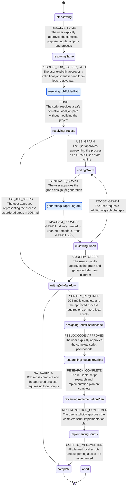

# design-job-v2 v0.3

```mermaid
stateDiagram-v2

    [*] --> interviewing

    interviewing --> resolvingName: RESOLVE_NAME<br/>The user explicitly approves the complete purpose, inputs, outputs, and process

    resolvingName --> resolvingJobFolderPath: RESOLVE_JOB_FOLDER_PATH<br/>The user explicitly approves a valid final job identifier and local-jobs-relative path

    resolvingJobFolderPath --> resolvingProcess: DONE<br/>The script resolves a safe tentative local job path without modifying the project

    resolvingProcess --> writingJobMarkdown: USE_JOB_STEPS<br/>The user approves representing the process as ordered steps in JOB.md
    resolvingProcess --> editingGraph: USE_GRAPH<br/>The user approves representing the process as a GRAPH.json state machine

    writingJobMarkdown --> complete: NO_SCRIPTS<br/>JOB.md is complete and the approved process requires no local scripts
    writingJobMarkdown --> designingScriptPseudocode: SCRIPTS_REQUIRED<br/>JOB.md is complete and the approved process requires one or more local scripts

    editingGraph --> generatingGraphDiagram: GENERATE_GRAPH<br/>The user approves the graph design for generation

    generatingGraphDiagram --> reviewingGraph: DIAGRAM_UPDATED<br/>GRAPH.md was created or updated from the current GRAPH.json

    reviewingGraph --> editingGraph: REVISE_GRAPH<br/>The user requests additional graph changes
    reviewingGraph --> writingJobMarkdown: CONFIRM_GRAPH<br/>The user explicitly approves the graph and generated Mermaid diagram

    designingScriptPseudocode --> researchingReusableScripts: PSEUDOCODE_APPROVED<br/>The user explicitly approves the complete script pseudocode

    researchingReusableScripts --> reviewingImplementationPlan: RESEARCH_COMPLETE<br/>The reusable-script research and implementation plan are complete

    reviewingImplementationPlan --> implementingScripts: IMPLEMENTATION_CONFIRMED<br/>The user explicitly approves the complete script implementation plan

    implementingScripts --> complete: SCRIPTS_IMPLEMENTED<br/>All planned local scripts and supporting assets are implemented

    complete --> [*]
    abort --> [*]

    classDef scriptState fill:#DCEBFF,stroke:#2563EB,stroke-width:2px,color:#111827
    classDef switchState fill:#FEE2E2,stroke:#DC2626,stroke-width:2px,color:#111827

    class resolvingJobFolderPath,generatingGraphDiagram scriptState
```
