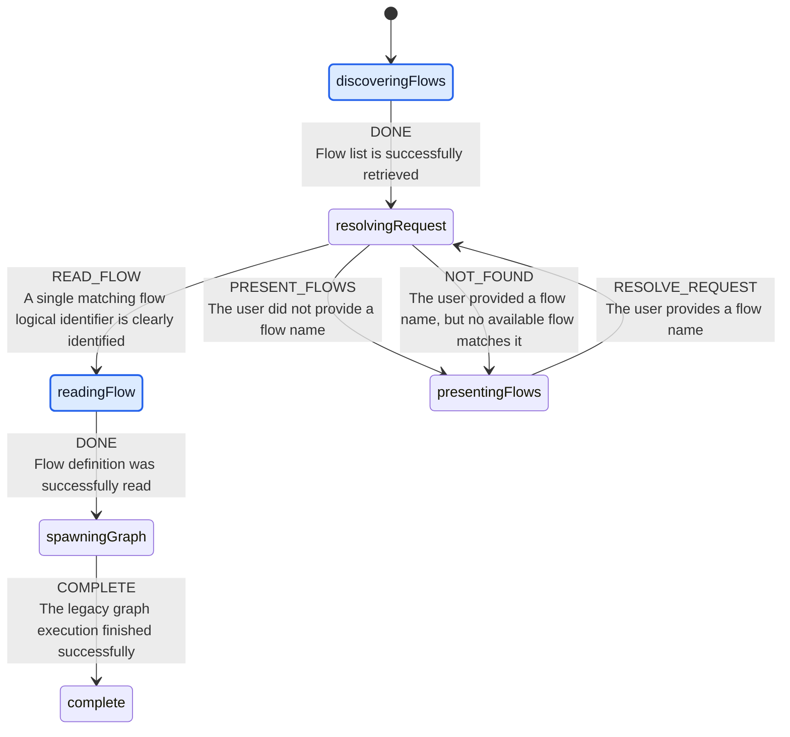

# graph v1.0

```mermaid
stateDiagram-v2

    [*] --> discoveringFlows

    discoveringFlows --> resolvingRequest: DONE<br/>Flow list is successfully retrieved

    resolvingRequest --> readingFlow: READ_FLOW<br/>A single matching flow logical identifier is clearly identified
    resolvingRequest --> presentingFlows: PRESENT_FLOWS<br/>The user did not provide a flow name
    resolvingRequest --> presentingFlows: NOT_FOUND<br/>The user provided a flow name, but no available flow matches it

    presentingFlows --> resolvingRequest: RESOLVE_REQUEST<br/>The user provides a flow name

    readingFlow --> spawningGraph: DONE<br/>Flow definition was successfully read

    spawningGraph --> complete: COMPLETE<br/>The legacy graph execution finished successfully

    classDef scriptState fill:#DCEBFF,stroke:#2563EB,stroke-width:2px,color:#111827
    classDef switchState fill:#FEE2E2,stroke:#DC2626,stroke-width:2px,color:#111827

    class discoveringFlows,readingFlow scriptState
```
