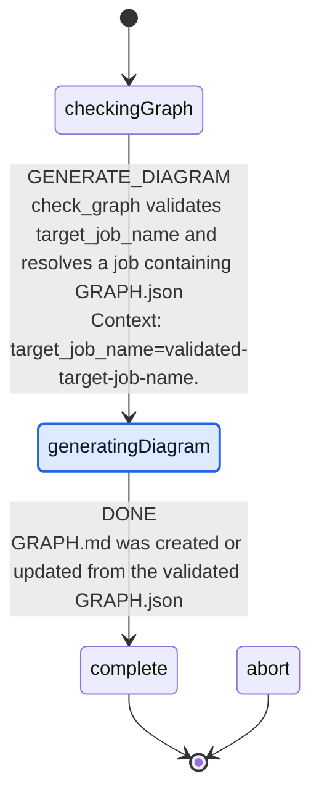

# generate-job-diagram v0.1

```mermaid
stateDiagram-v2

    [*] --> checkingGraph

    checkingGraph --> generatingDiagram: GENERATE_DIAGRAM<br/>check_graph validates target_job_name and resolves a job containing GRAPH.json<br/>Context: target_job_name=validated-target-job-name.

    generatingDiagram --> complete: DONE<br/>GRAPH.md was created or updated from the validated GRAPH.json

    complete --> [*]
    abort --> [*]

    classDef scriptState fill:#DCEBFF,stroke:#2563EB,stroke-width:2px,color:#111827
    classDef switchState fill:#FEE2E2,stroke:#DC2626,stroke-width:2px,color:#111827
    classDef spawnState fill:#FEF3C7,stroke:#D97706,stroke-width:2px,color:#111827

    class generatingDiagram scriptState
```
