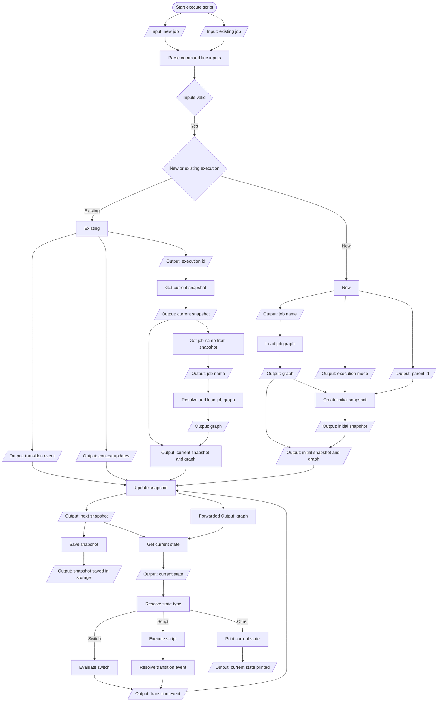

```mermaid
flowchart TB
    start(["Start execute script"]) --> cliStart[/"Input: new job"/] & cliContinue[/"Input: existing job"/]
    cliStart --> parse["Parse command line inputs"]
    cliContinue --> parse
    parse --> validateInputs{"Inputs valid"}
    validateInputs -- Yes --> executionType{"New or existing execution"}
    jobName[/"Output: job name"/] --> resolveGraphNew["Load job graph"]
    resolveGraphNew --> newGraph[/"Output: graph"/]
    newGraph --> createInitial["Create initial snapshot"] & n5[/"Output: initial snapshot and graph"/]
    executionMode[/"Output: execution mode"/] --> createInitial
    createInitial --> snapshot[/"Output: initial snapshot"/]
    executionId[/"Output: execution id"/] --> getSnapshot["Get current snapshot"]
    currentSnapshot[/"Output: current snapshot"/] --> getJobName["Get job name from snapshot"] & n6["Output: current snapshot and graph"]
    getJobName --> existingJobName[/"Output: job name"/]
    existingJobName --> resolveGraphExisting["Resolve and load job graph"]
    resolveGraphExisting --> existingGraph[/"Output: graph"/]
    snapshot --> n5
    cliEvent[/"Output: transition event"/] --> updateSnapshot["Update snapshot"]
    existingGraph --> n6
    updateSnapshot --> nextSnapshot[/"Output: next snapshot"/] & n7["Forwarded Output: graph"]
    nextSnapshot --> saveSnapshot["Save snapshot"] & getState["Get current state"]
    saveSnapshot --> savedSnapshot[/"Output: snapshot saved in storage"/]
    getState --> currentState[/"Output: current state"/]
    currentState --> resolveType["Resolve state type"]
    resolveType -- Script --> executeScript["Execute script"]
    executeScript --> resolveScriptEvent["Resolve transition event"]
    resolveType -- Switch --> evaluateSwitch["Evaluate switch"]
    evaluateSwitch --> switchEvent[/"Output: transition event"/]
    switchEvent --> updateSnapshot
    resolveType -- Other --> printState["Print current state"]
    printState --> printedState[/"Output: current state printed"/]
    executionType -- Existing --> n1["Existing"]
    n1 --> executionId & cliEvent & n2[/"Output: context updates"/]
    n2 --> updateSnapshot
    n3["New"] --> jobName & executionMode & n4[/"Output: parent id"/]
    executionType -- New --> n3
    n4 --> createInitial
    n6 --> updateSnapshot
    n5 --> updateSnapshot
    n7 --> getState
    getSnapshot --> currentSnapshot
    resolveScriptEvent --> switchEvent
```