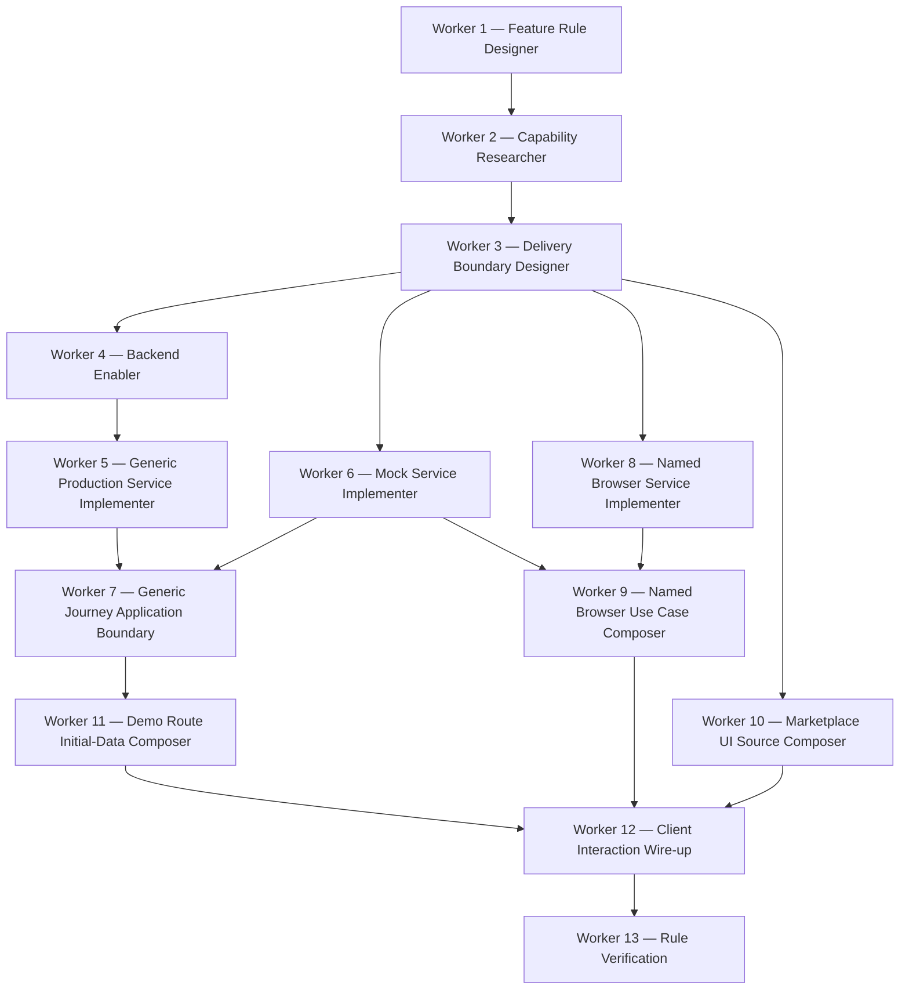

# Feature-rule delivery — dependency diagram v2

This flow implements one rule end-to-end. Workers run only after their direct
dependencies complete. Optional workers run only when the delivery boundary
requires their operation class.

## Boundary rules

- Generic server operations follow `service → repository → repository factory → generic use case` and may be exported through the journey use-case barrel.
- Named browser operations follow `named service → named factory in infrastructure/repository → named use case`; their service and use case are imported directly, never through barrels.
- Server initial data belongs in a page or layout. Client hooks own only user-triggered interaction.
- The Marketplace UI receives separate sources and decides its presentation mode; Demo routes transport typed props without choosing UI modes.
