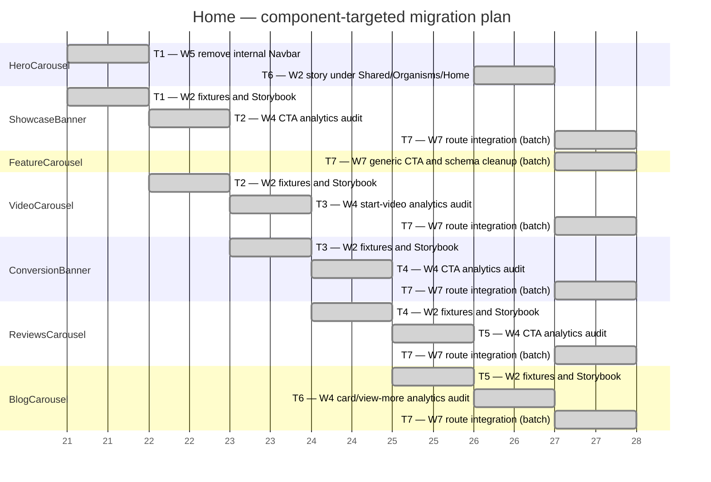

# Home — migration Gantt

This plan covers only the remaining work for the existing App Router journey. `InfoBanner`, `Navbar`, `PreFooterBanner`, and `Footer` are already complete for Home and are excluded. `HeroCarousel` remains technical debt because its form must own its specialized stacks; the scheduled W5 task only removes its duplicate internal Navbar. The legacy page is reference-only and MUST NOT be modified.

## Target and worker assignment

| Legacy component | Current organism | W1 | W2 | W3 | W4 | W5 | W6 | W7 | W8 | W9 | Notes |
| --- | --- | --- | --- | --- | --- | --- | --- | --- | --- | --- | --- |
| `HeroCarousel` | `HeroCarousel` | — | — | — | — | Yes | — | — | — | — | Comment/remove the internal Navbar; the form-stack redesign remains technical debt. |
| `InfoBanner` | `InfoBanner` | — | — | — | — | — | — | — | — | — | Already complete with fixtures, stories, analytics, and route integration. |
| `ShowcaseBanner` | `ShowcaseBanner` | — | Yes | — | Yes | — | — | Yes | — | — | Add missing fixtures/stories; audit CTA generic vs Home-specific schema; then integrate. |
| `FeatureCarousel` | `FeatureCarousel` | — | — | — | — | — | — | Yes | — | — | Switch to generic CTA tracking and remove redundant Home-specific schema. |
| `VideoCarousel` | `VideoCarousel` | — | Yes | — | Yes | — | — | Yes | — | — | Add fixtures/stories; audit `startVideo` only; then integrate. |
| `ConversionBanner` | `ConversionBanner` | — | Yes | — | Yes | — | — | Yes | — | — | Add fixtures/stories; audit generic vs Home-specific CTA; then integrate. |
| `ReviewsCarousel` | `ReviewsCarousel` | — | Yes | — | Yes | — | — | Yes | — | — | Add fixtures/stories; audit generic vs Home-specific CTA; then integrate. |
| `BlogCarousel` | `BlogCarousel` | — | Yes | — | Yes | — | — | Yes | — | — | Add fixtures/stories; audit card click and view-more events; then integrate. |
| `PreFooterBanner` | `PreFooterBanner` | — | — | — | — | — | — | — | — | — | Already available with coverage and analytics. |
| `Footer` | `Footer` | — | — | — | — | — | — | — | — | — | Already available with coverage and analytics. |

W6 is excluded because the App Router route already exists. W8/W9 are excluded from execution; the molecule/atom boundaries of these older carousel organisms remain technical debt.

## Parallel execution order

No unit contains more than two parallel tasks through T6. Each component follows its own W2 → W4 → W7 dependency chain; T7 is the sole authorized W7 batch.

1. T1 starts W5 HeroCarousel cleanup and W2 ShowcaseBanner fixtures.
2. T2–T5 pair one W2 task with one W4 task while advancing each component chain.
3. T6 runs W2 HeroCarousel story coverage alongside the final W4 audit.
4. T7 is the only intentional batch: it dispatches all six remaining W7 tasks, including FeatureCarousel's generic-CTA/schema cleanup.
5. Tracking APIs remain inside organisms; the route only supplies registered targets.

Technical debt: redesign `HeroCarousel` form stacks and revisit molecule/atom boundaries across the carousel organisms after the migration is complete.
