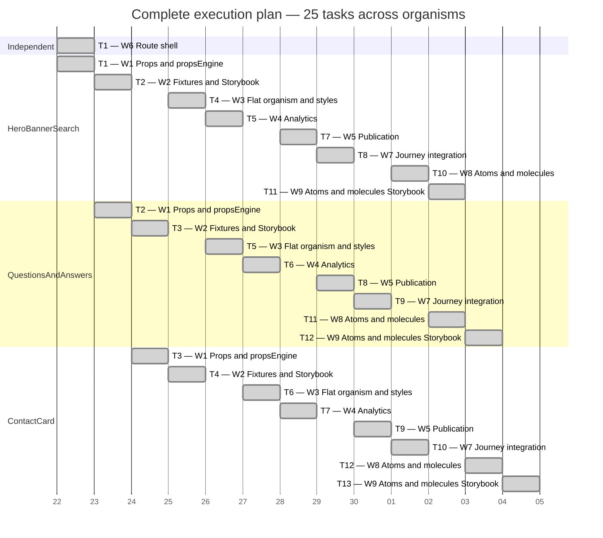

# Preguntas Frecuentes — Gantt Diagram

The dates below are logical, uniform-duration execution slots rather than estimates. Each Gantt task is one target-area instance of a dependency-diagram worker responsibility. Therefore, a Worker 2 task includes both its fixture and Storybook substeps; they MUST NOT be scheduled as separate Worker 2 tasks for the same organism.

`done` tasks are recorded history and render with Mermaid's completed-task color.

When one persistent worker is already assigned in a time unit, an eligible task from the next dependency layer MAY fill the second slot with a different worker. This is why W4 begins HeroBannerSearch analytics in T5 while W3 continues its sequential QuestionsAndAnswers and ContactCard implementations.

T13 has one task because the ContactCard W9 instance is the final eligible task; no second task remains without duplicating the persistent W9 worker.
