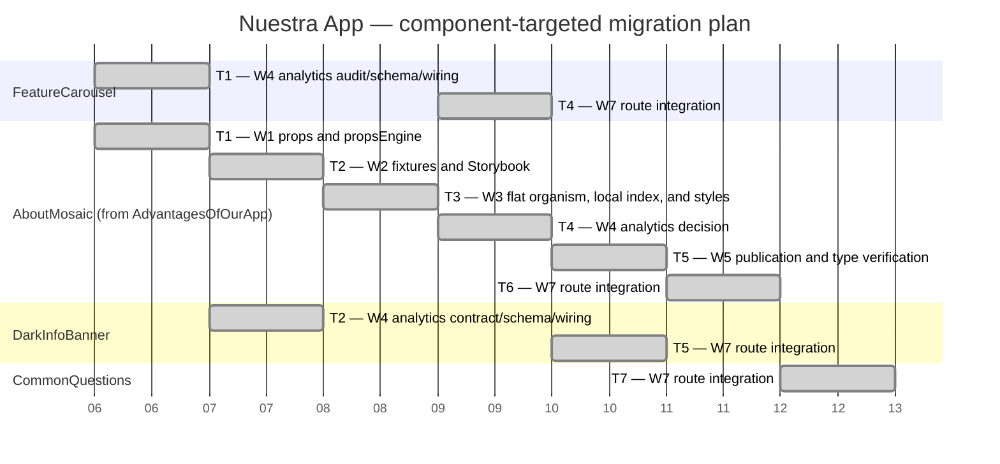

# Nuestra App — Gantt Diagram

The App Router route and the shared organism implementations already exist. This plan schedules only the missing work for the journey; Navbar, HeroBanner, PreFooterBanner, Footer, route creation, and full organism creation are intentionally excluded.

Each task is an instantiation of a dependency-diagram worker responsibility for the target area shown below. Worker 2 owns fixtures and Storybook together. Worker 4 owns the analytics contract, schema registration, and in-organism wiring. Tracking APIs (`useTracking` and `TrackedAction`) MUST remain inside organisms; the journey only passes registered `analytics` targets.

## Worker applicability by target component

| Worker | Target component | Applies | Responsibility |
| --- | --- | --- | --- |
| W1 — Organism Contract | `AboutMosaic` (from `AdvantagesOfOurApp`) | Yes | Create the new organism props contract and `propsEngine`. |
| W1 — Organism Contract | `FeatureCarousel`, `DarkInfoBanner`, `CommonQuestions` | No | Existing contracts are sufficient; analytics changes belong to W4 where applicable. |
| W2 — Fixtures and Storybook | `AboutMosaic` | Yes | Create contract-valid fixtures and complete organism Storybook coverage. |
| W2 — Fixtures and Storybook | `FeatureCarousel`, `DarkInfoBanner`, `CommonQuestions` | No | Existing story coverage is sufficient for this journey, except FeatureCarousel's behavior is intentionally left in place while its future library replacement is pending. |
| W3 — Flat Organism | `AboutMosaic` | Yes | Create the new organism from `AdvantagesOfOurApp`, using only approved `@shared` pieces, with its local index and scoped styles. |
| W3 — Flat Organism | `FeatureCarousel`, `DarkInfoBanner`, `CommonQuestions` | No | These existing organisms do not need structural reorganization for this journey. |
| W4 — Organism Analytics | `FeatureCarousel` | Yes | Preserve the existing organism while auditing/registering its CTA tracker; its behavior will later be replaced by a library. |
| W4 — Organism Analytics | `DarkInfoBanner` | Yes | Replace the legacy callback contract with a registered `TrackingTarget` API and in-organism tracking. |
| W4 — Organism Analytics | `AboutMosaic` | Yes | Audit the new organism's interactions and return `none` if it has no perceptible interaction; the full workflow still records the decision. |
| W4 — Organism Analytics | `CommonQuestions` | No | It already has compatible analytics. |
| W5 — Organism Publication | `AboutMosaic` | Yes | Export the new organism from the global barrel and run component-scoped type verification. |
| W5 — Organism Publication | `FeatureCarousel`, `DarkInfoBanner`, `CommonQuestions` | No | Their local indexes and global organism exports already exist. |
| W6 — New Journey | All target components | No | The App Router route already exists; no route-shell migration is scheduled. |
| W7 — Journey Integration | `FeatureCarousel`, `AboutMosaic`, `DarkInfoBanner`, `CommonQuestions` | Yes | Configure analytics where required, preserve `propsEngine` mapping, replace the old FeaturesCards usage with AboutMosaic, and verify final route usage. |
| W8 — Atoms and Molecules | `AboutMosaic` | Yes | Review the new organism for genuinely reusable pieces; return `none` if inline composition is the correct design. |
| W8 — Atoms and Molecules | `FeatureCarousel`, `DarkInfoBanner`, `CommonQuestions` | No | Explicitly excluded by the target-area decisions. |
| W9 — Atom/Molecule Storybook | `AboutMosaic` | Conditional per W8 result | Create stories only for atoms/molecules actually created or changed by AboutMosaic's W8 task. |
| W9 — Atom/Molecule Storybook | `FeatureCarousel`, `DarkInfoBanner`, `CommonQuestions` | No | No W8 outputs are planned for these components. |

No W6 route-shell task is scheduled. AboutMosaic is the only target receiving the complete organism workflow that was executed; FeatureCarousel, DarkInfoBanner, and CommonQuestions use the narrower worker paths defined above. A possible `AboutMosaicCard` extraction remains documented as technical debt in the checklist.
