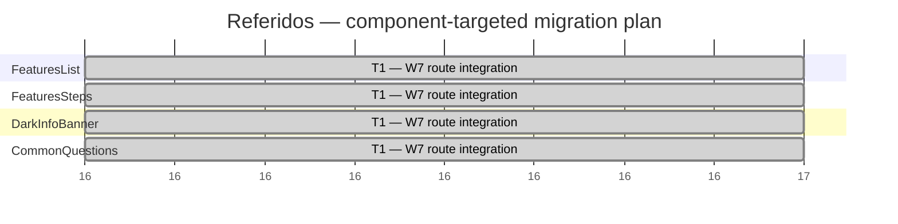

# Referidos — migration Gantt

This plan covers only the remaining work for the existing App Router journey. `Navbar`, `HeroBanner`, `PreFooterBanner`, `Footer`, the route shell, and organism creation/publication are already available and are excluded. Existing contracts, fixtures, and Storybook coverage are reused. The legacy page is reference-only and MUST NOT be modified.

## Target and worker assignment

| Legacy component | Current organism | W1 | W2 | W3 | W4 | W5 | W7 | Notes |
| --- | --- | --- | --- | --- | --- | --- | --- | --- |
| `FeaturesList` | `FeaturesList` | No | No | No | No | No | Yes | Existing organism; route integration only. |
| `FeaturesSteps` | `FeaturesSteps` | No | No | No | No | No | Yes | Analytics was audited in Tarjeta de Crédito; configure the existing common targets. |
| `DarkInfoBanner` | `DarkInfoBanner` | No | No | No | No | No | Yes | Analytics was audited in Tarjeta de Crédito; configure the existing `common.ctaClicked` target. |
| `FaqV3` | `CommonQuestions` | No | No | No | No | No | Yes | Reuse existing common analytics and Storybook coverage. |

W6 is excluded because the App Router route already exists. W8/W9 are excluded because this journey reuses existing organisms and introduces no new reusable pieces.

## Execution order

All target organisms reuse analytics audits completed in earlier journeys. T1 dispatches W7 for `FeaturesList`, `FeaturesSteps`, `DarkInfoBanner`, and `CommonQuestions` in parallel. Tracking APIs remain inside organisms; the route only supplies registered targets.

Only the listed units are in scope. No new atom/molecule extraction is planned for this journey.
