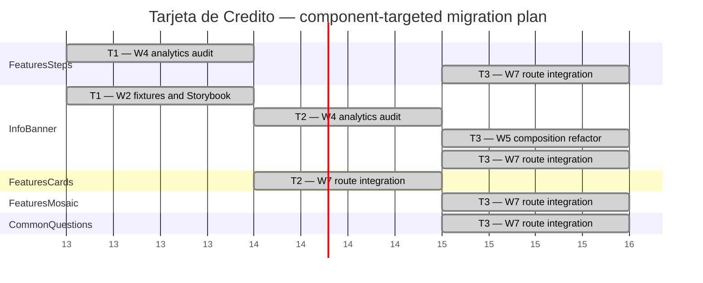

# Tarjeta de Credito — migration Gantt

This plan covers only work still needed for the existing App Router journey. `Navbar`, `HeroBanner`, `PreFooterBanner`, `Footer`, the route shell, and organism creation/publication are already available and are excluded. Existing organism contracts, fixtures, and Storybook coverage are reused. The legacy page is reference-only and MUST NOT be modified.

## Target and worker assignment

| Legacy component | Current organism | W1 | W2 | W3 | W4 | W5 | W7 | Notes |
| --- | --- | --- | --- | --- | --- | --- | --- | --- |
| `FeaturesCards` | `FeaturesCards` | No | No | No | No | No | Yes | Existing organism; route integration only. |
| `FeaturesSteps` | `FeaturesSteps` | No | No | No | Yes | No | Yes | Audit the legacy step/CTA trackers, then configure the route target(s). |
| `InfoBanner` | `InfoBanner` | No | Yes | No | Yes | Yes | Yes | Add fixtures, audit analytics, flatten the CTA/copy composition, then integrate the route. |
| `FeaturesMosaic2` | `FeaturesMosaic` | No | No | No | No | No | Yes | Reuse the migrated organism and its `propsEngine`. |
| `FaqV3` | `CommonQuestions` | No | No | No | No | No | Yes | Existing common analytics contract and Storybook coverage are reused. |

W6 is excluded because the App Router route already exists. W8/W9 are excluded because this journey reuses existing organisms and introduces no new reusable pieces.

## Execution order

The three time units intentionally use parallel work. T3 is a deliberate batch: the independent W7 integrations are dispatched together rather than serialized.

1. T1 runs W4 for `FeaturesSteps` analytics and W2 for `InfoBanner` fixtures/Storybook in parallel.
2. T2 runs W4 for `InfoBanner` analytics and W7 for `FeaturesCards` integration in parallel.
3. T3 runs the W5 `InfoBanner` refactor and the W7 integrations for `FeaturesSteps`, `InfoBanner`, `FeaturesMosaic`, and `CommonQuestions` in parallel.
4. No tracking API may be called from the route; `useTracking`/`TrackedAction` remain inside organisms.

Only the listed units are in scope. Technical debt: `InfoBanner` still needs Storybook stories for its extracted molecules/atoms. A later component refactor may be planned separately if an actual reusable-piece need appears.
