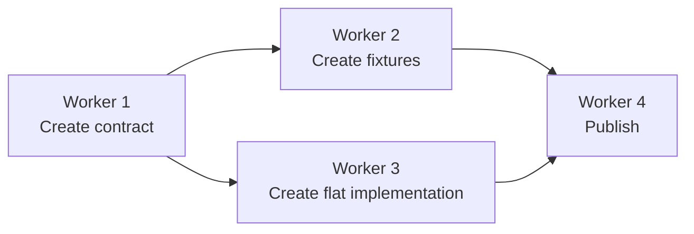
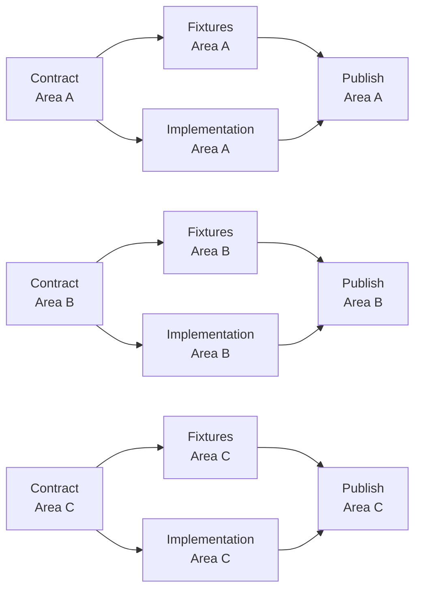
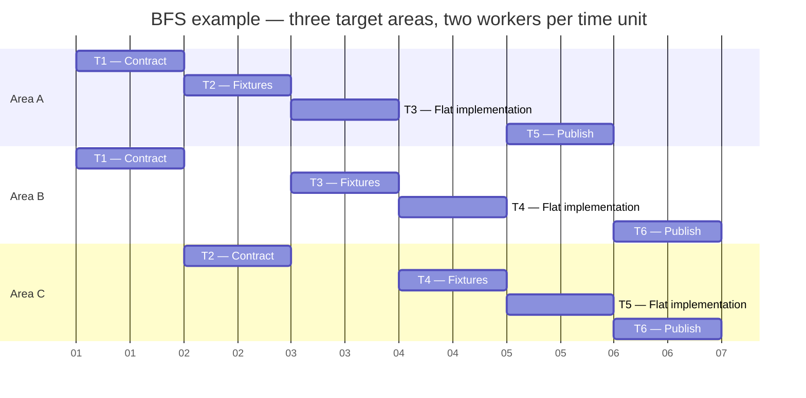

# Gantt Scheduling Algorithm

## Core Model

A dependency diagram defines a reusable **workflow template**. A worker is a responsibility in that template; it is not, by itself, a Gantt node.

A Gantt task is an instantiation of one worker responsibility for one target area. For example:

```text
Worker 1: Contract
Target area: Area A
Gantt task: Contract(Area A)
```

The same workflow can be instantiated for `Area A`, `Area B`, and `Area C`. Therefore, `Contract(Area A)`, `Contract(Area B)`, and `Contract(Area C)` are separate Gantt tasks even though they use the same worker responsibility.

## Eligibility

- A task is eligible only when every predecessor task for the same target area is complete.
- A task with a global prerequisite is eligible only when that global prerequisite is complete as well.
- The orchestrator creates task instances from the dependency template and the requested target areas; workers do not construct or manage the schedule themselves.

## Breadth-First Scheduling

1. Build the task graph by instantiating the dependency template once per target area.
2. Start with every task that has no incomplete prerequisite.
3. Select tasks from the shallowest available dependency layer first.
4. When a time unit has a free worker slot after selecting all available tasks at that layer, fill it with the next eligible task from the following layer.
5. When tasks have the same dependency layer, use the target-area order established by the Gantt as the tie-breaker.
6. Put exactly two selected tasks into each discrete time unit.
7. Do not advance to the next time unit until both selected tasks finish and the user authorizes continuation.

This is breadth-first search (BFS) over **task instances**, not over worker names.

## Small Dependency Template Example



For each target area, the template becomes this task dependency graph:



## BFS Gantt Example

With two workers per time unit, the following Gantt is a breadth-first schedule for the three-area graph above. Publication tasks wait while eligible contract, fixture, or implementation tasks remain at shallower layers.



The first publication, `Publish(Area A)`, is scheduled only after every eligible shallower task that could fill earlier time units has been dispatched. The same algorithm scales to any number of workflow targets without changing the dependency template.
