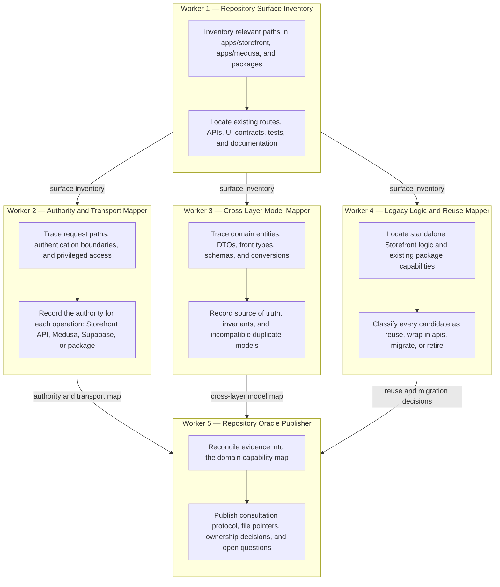

# Repository capability intelligence — dependency diagram

This flow maintains a queryable, evidence-backed repository oracle. Its area is a
domain slice (for example, cart), not a single implementation request. The final
capability map is a global prerequisite for service and data-model work in the
feature-rule-delivery flow.

## Deliverable

`.loop/artifacts/capability-map.md`, maintained per domain slice. It is the durable consultation
artifact for all downstream workers; it is not an execution log.
