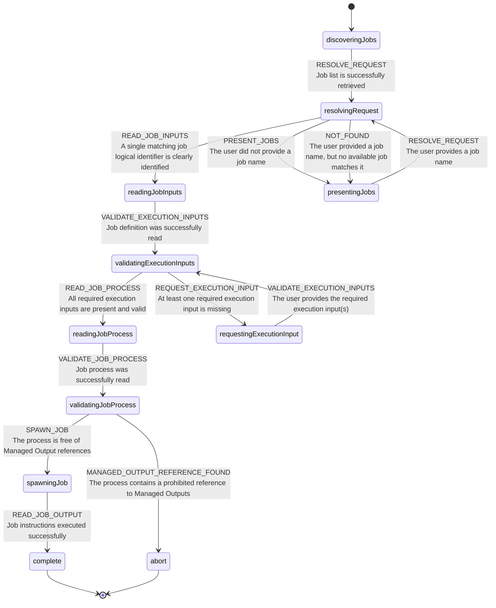
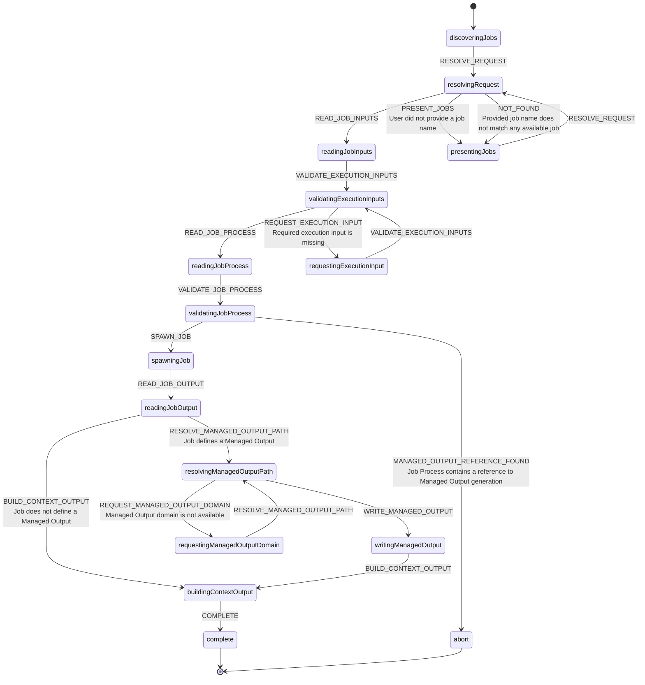

# Current machine

```mermaid
stateDiagram-v2
    [*] --> discoveringJobs

    discoveringJobs --> resolvingRequest: RESOLVE_REQUEST<br/>Job list is successfully retrieved

    resolvingRequest --> readingJobInputs: READ_JOB_INPUTS<br/>A single matching job logical identifier is clearly identified

    resolvingRequest --> presentingJobs: PRESENT_JOBS<br/>The user did not provide a job name

    resolvingRequest --> presentingJobs: NOT_FOUND<br/>The user provided a job name, but no available job matches it

    presentingJobs --> resolvingRequest: RESOLVE_REQUEST<br/>The user provides a job name


    readingJobInputs --> validatingExecutionInputs: VALIDATE_EXECUTION_INPUTS<br/>Job definition was successfully read

    validatingExecutionInputs --> readingJobProcess: READ_JOB_PROCESS<br/>All required execution inputs are present and valid

    validatingExecutionInputs --> requestingExecutionInput: REQUEST_EXECUTION_INPUT<br/>At least one required execution input is missing

    requestingExecutionInput --> validatingExecutionInputs: VALIDATE_EXECUTION_INPUTS<br/>The user provides the required execution input(s)


    readingJobProcess --> validatingJobProcess: VALIDATE_JOB_PROCESS<br/>Job process was successfully read

    validatingJobProcess --> spawningJob: SPAWN_JOB<br/>The process is free of Managed Output references

    validatingJobProcess --> abort: MANAGED_OUTPUT_REFERENCE_FOUND<br/>The process contains a prohibited reference to Managed Outputs


    spawningJob --> complete: READ_JOB_OUTPUT<br/>Job instructions executed successfully

    complete --> [*]
    abort --> [*]
```

# Milestone objective

```mermaid
stateDiagram-v2
    [*] --> discoveringJobs

    discoveringJobs --> resolvingRequest: RESOLVE_REQUEST

    resolvingRequest --> readingJobInputs: READ_JOB_INPUTS

    resolvingRequest --> presentingJobs: PRESENT_JOBS<br/>User did not provide a job name

    resolvingRequest --> presentingJobs: NOT_FOUND<br/>Provided job name does not match any available job

    presentingJobs --> resolvingRequest: RESOLVE_REQUEST


    readingJobInputs --> validatingExecutionInputs: VALIDATE_EXECUTION_INPUTS

    validatingExecutionInputs --> readingJobProcess: READ_JOB_PROCESS

    validatingExecutionInputs --> requestingExecutionInput: REQUEST_EXECUTION_INPUT<br/>Required execution input is missing

    requestingExecutionInput --> validatingExecutionInputs: VALIDATE_EXECUTION_INPUTS


    readingJobProcess --> validatingJobProcess: VALIDATE_JOB_PROCESS

    validatingJobProcess --> spawningJob: SPAWN_JOB

    validatingJobProcess --> abort: MANAGED_OUTPUT_REFERENCE_FOUND<br/>Job Process contains a reference to Managed Output generation


    spawningJob --> readingJobOutput: READ_JOB_OUTPUT

    readingJobOutput --> resolvingManagedOutputPath: RESOLVE_MANAGED_OUTPUT_PATH<br/>Job defines a Managed Output

    readingJobOutput --> buildingContextOutput: BUILD_CONTEXT_OUTPUT<br/>Job does not define a Managed Output


    resolvingManagedOutputPath --> writingManagedOutput: WRITE_MANAGED_OUTPUT

    resolvingManagedOutputPath --> requestingManagedOutputDomain: REQUEST_MANAGED_OUTPUT_DOMAIN<br/>Managed Output domain is not available

    requestingManagedOutputDomain --> resolvingManagedOutputPath: RESOLVE_MANAGED_OUTPUT_PATH


    writingManagedOutput --> buildingContextOutput: BUILD_CONTEXT_OUTPUT

    buildingContextOutput --> complete: COMPLETE

    complete --> [*]
    abort --> [*]
```