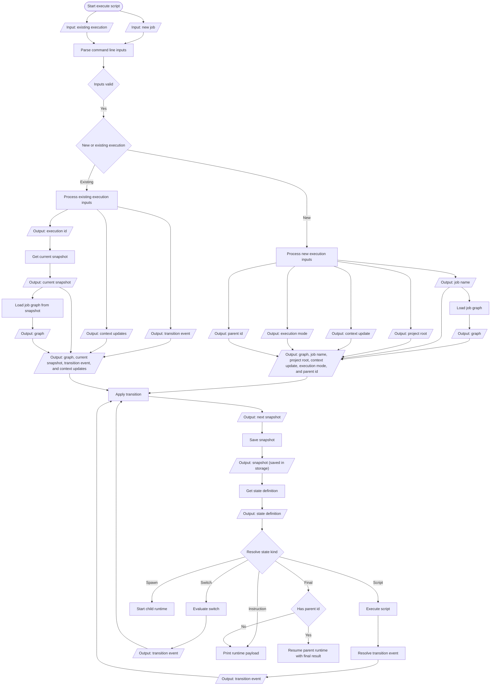

# Execute V2 flow

This document describes the execution flow implemented by the V2 executor.

## Runtime semantics

- `applyTransition` MUST create the initial snapshot when it receives a graph, job name, project root, context updates, execution mode, and parent id without an existing snapshot.
- `applyTransition` MUST apply context updates before resolving the transition target, because the target state MAY immediately interpolate a new context value.
- The existing-execution branch MUST load the graph from `snapshot.machine_name`; it MUST NOT expose a separate get-job-name step.
- A `spawn` state MUST keep its parent snapshot in the current spawn state while it starts the child runtime selected by its `spawn` command.
- A spawn state MUST start the child runtime and yield control to it. It MUST NOT print a parent payload or advance the parent when the child starts. When a child reaches a final state with a parent id, the runtime MUST resume that parent automatically with the final state's result event; it MUST NOT require an agent instruction to continue the parent.
- A final state MUST declare its terminal result event, such as `DONE` or `ERROR`. A final execution without a parent id MUST print its final runtime payload.
