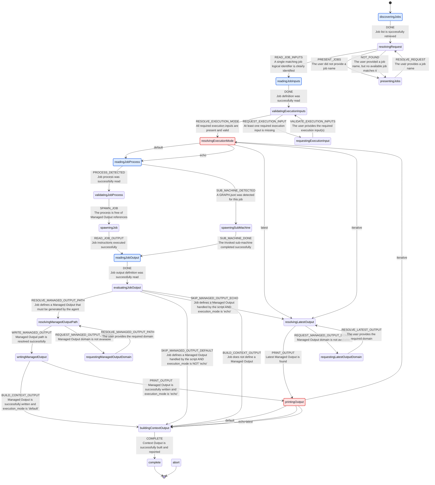

# execute-job v1.0

```mermaid
stateDiagram-v2

    [*] --> discoveringJobs

    discoveringJobs --> resolvingRequest: DONE<br/>Job list is successfully retrieved

    resolvingRequest --> readingJobInputs: READ_JOB_INPUTS<br/>A single matching job logical identifier is clearly identified
    resolvingRequest --> presentingJobs: PRESENT_JOBS<br/>The user did not provide a job name
    resolvingRequest --> presentingJobs: NOT_FOUND<br/>The user provided a job name, but no available job matches it

    presentingJobs --> resolvingRequest: RESOLVE_REQUEST<br/>The user provides a job name

    readingJobInputs --> validatingExecutionInputs: DONE<br/>Job definition was successfully read

    validatingExecutionInputs --> resolvingExecutionMode: RESOLVE_EXECUTION_MODE<br/>All required execution inputs are present and valid
    validatingExecutionInputs --> requestingExecutionInput: REQUEST_EXECUTION_INPUT<br/>At least one required execution input is missing

    requestingExecutionInput --> validatingExecutionInputs: VALIDATE_EXECUTION_INPUTS<br/>The user provides the required execution input(s)

    resolvingExecutionMode --> readingJobProcess: default
    resolvingExecutionMode --> readingJobProcess: echo
    resolvingExecutionMode --> resolvingLatestOutput: latest
    resolvingExecutionMode --> resolvingLatestOutput: iterative

    readingJobProcess --> validatingJobProcess: PROCESS_DETECTED<br/>Job process was successfully read
    readingJobProcess --> spawningSubMachine: SUB_MACHINE_DETECTED<br/>A GRAPH.json was detected for this job

    validatingJobProcess --> spawningJob: SPAWN_JOB<br/>The process is free of Managed Output references

    spawningSubMachine --> readingJobOutput: SUB_MACHINE_DONE<br/>The invoked sub-machine completed successfully

    spawningJob --> readingJobOutput: READ_JOB_OUTPUT<br/>Job instructions executed successfully

    readingJobOutput --> evaluatingJobOutput: DONE<br/>Job output definition was successfully read

    evaluatingJobOutput --> resolvingManagedOutputPath: RESOLVE_MANAGED_OUTPUT_PATH<br/>Job defines a Managed Output that must be generated by the agent
    evaluatingJobOutput --> buildingContextOutput: SKIP_MANAGED_OUTPUT_DEFAULT<br/>Job defines a Managed Output handled by the script AND execution_mode is NOT 'echo'
    evaluatingJobOutput --> resolvingLatestOutput: SKIP_MANAGED_OUTPUT_ECHO<br/>Job defines a Managed Output handled by the script AND execution_mode is 'echo'
    evaluatingJobOutput --> buildingContextOutput: BUILD_CONTEXT_OUTPUT<br/>Job does not define a Managed Output

    resolvingManagedOutputPath --> writingManagedOutput: WRITE_MANAGED_OUTPUT<br/>Managed Output path is resolved successfully
    resolvingManagedOutputPath --> requestingManagedOutputDomain: REQUEST_MANAGED_OUTPUT_DOMAIN<br/>Managed Output domain is not available

    requestingManagedOutputDomain --> resolvingManagedOutputPath: RESOLVE_MANAGED_OUTPUT_PATH<br/>The user provides the required domain

    writingManagedOutput --> buildingContextOutput: BUILD_CONTEXT_OUTPUT<br/>Managed Output is successfully written and execution_mode is 'default'
    writingManagedOutput --> printingOutput: PRINT_OUTPUT<br/>Managed Output is successfully written and execution_mode is 'echo'

    resolvingLatestOutput --> printingOutput: PRINT_OUTPUT<br/>Latest Managed Output is found
    resolvingLatestOutput --> requestingLatestOutputDomain: REQUEST_MANAGED_OUTPUT_DOMAIN<br/>Managed Output domain is not available

    requestingLatestOutputDomain --> resolvingLatestOutput: RESOLVE_LATEST_OUTPUT<br/>The user provides the required domain

    printingOutput --> resolvingExecutionMode: iterative
    printingOutput --> buildingContextOutput: default
    printingOutput --> buildingContextOutput: echo
    printingOutput --> buildingContextOutput: latest

    buildingContextOutput --> complete: COMPLETE<br/>Context Output is successfully built and reported

    complete --> [*]
    abort --> [*]

    classDef scriptState fill:#DCEBFF,stroke:#2563EB,stroke-width:2px,color:#111827
    classDef switchState fill:#FEE2E2,stroke:#DC2626,stroke-width:2px,color:#111827

    class discoveringJobs,readingJobInputs,readingJobProcess,readingJobOutput scriptState
    class resolvingExecutionMode,printingOutput switchState
```
