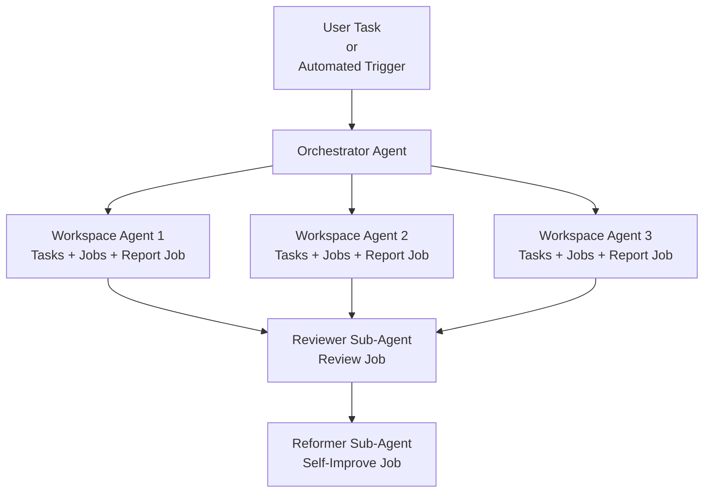

# Loop

Complete the user's work effectively while gradually improving how the system works.

## Flow



## Concepts

**Orchestrator** — The main agent. It understands the request, reads applicable Rules and Jobs, creates the execution plan, delegates work, and coordinates the post-work improvement loop.

**Rule** — Reusable guidance that constrains or informs how work is performed. Rules may include constraints, conventions, patterns, snippets, or other reusable knowledge. Rules may be global or domain-specific.

**Job** — A reusable unit of work defined by an input, a process, and an output.

**Workspace Agent** — A subagent responsible for delegated work. It executes an ad-hoc task, one or more assigned Jobs, or both.

**Reviewer** — A subagent responsible for evaluating completed work by executing the `review` Job.

**Reformer** — A subagent responsible for improving the system by executing the `self-improve` Job.

## Folder Structure

All paths are relative to the project root:

```text
.loop/
├── rules/
│   ├── RULES.md
│   └── <domain>/
│       └── RULES.md
└── jobs/
    └── <job>/
        └── JOB.md
```

## Instructions

The agent that read this skill is the Orchestrator. It is responsible for understanding the request, loading the relevant system knowledge, planning the work, delegating execution, and coordinating the post-work improvement loop.

### Pre-Work & Execution Plan

1. You MUST understand the user's requested outcome before planning execution.

2. You MUST read the relevant system artifacts from the project root:

   * Main rules file `.loop/rules/RULES.md` MUST always be read unless it has already been read and remains applicable to the current context.
   * Relevant `.loop/rules/<domain>/RULES.md` files MUST be identified and read only if they have not already been read and appear useful for the current request.
   * Relevant Jobs from `.loop/jobs/` MUST be identified and read only if they have not already been read and appear useful for completing the request.

3. You MUST create and present a concise execution plan using the applicable Rules and relevant Jobs. Independent work SHOULD be modeled in parallel when possible.

4. You MUST wait for the user's approval before executing the plan.

### Work

1. After approval, you SHOULD delegate executable work to Workspace Agents and a prompt following the Subagent Prompt Template.
   - **Task**: A Workspace Agent MAY receive an ad-hoc task, one or more explicitly assigned Jobs, or both. The prompt MUST instruct the Workspace Agent to execute the `report` Job after completing its assigned task and Jobs, and return the report link to the Orchestrator.

### Post-Work

1. After the Workspace Agents complete their work and reports, you MUST delegate evaluation using the `review` Job and a prompt following the Subagent Prompt Template.

2. After the review completes, you MUST delegate system improvement using the `self-improve` Job and a prompt following the Subagent Prompt Template.

## Subagent Prompt Template

1. The Orchestrator MUST provide every subagent with a prompt using this template:

   **Task**
   > State the objective as an action and the expected outcome.

   **Context**
   > Provide the relevant information, artifacts, documentation, decisions, limits, scope, and considerations required for the work. Do not repeat Rules already available in `RULES.md` files.

   **Inputs**
   > Provide the actions, values, files, paths, and prior outputs required by the assigned Jobs.

   **Rules Inspection**
   * You MUST read the following Rules:
     - `.loop/rules/RULES.md`
     - [Link to domain-specific Rule 1]
     - [Link to domain-specific Rule 2]
   * You MAY inspect additional domain Rules if you determine they are relevant to your assigned work.

   **Jobs Inspection**
   * You MUST read and execute the following Jobs:
     - [Link to Job 1]
     - [Link to Job 2]
   * You MUST NOT execute or inspect other Jobs unless the Orchestrator explicitly assigns them.
