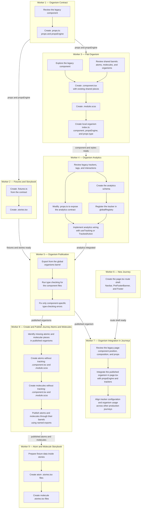

# Dependency Diagram Example

```mermaid
flowchart TB
    subgraph W1 [Worker 1 — Organism Contract]
        direction TB
        W1A["Review the legacy component"]
        W1B["Create .props.ts:<br/>props and propsEngine"]
        W1A --> W1B
    end

    subgraph W2 [Worker 2 — Fixtures and Storybook]
        direction TB
        W2A["Create .fixtures.ts<br/>from the contract"]
        W2B["Create .stories.tsx"]
        W2A --> W2B
    end

    subgraph W3 [Worker 3 — Flat Organism]
        direction TB
        W3A["Explore the legacy component"]
        W3B["Review shared barrels:<br/>atoms, molecules, and organisms"]
        W3C["Create .component.tsx<br/>with existing shared pieces"]
        W3D["Create .module.scss"]
        W3E["Create local organism index.ts:<br/>component, propsEngine, and props type"]
        W3A --> W3C
        W3B --> W3C
        W3C --> W3D
        W3D --> W3E
    end

    subgraph W4["Worker 4 — Organism Analytics"]
        direction TB
        W4A["Review legacy trackers, tags, and interactions"]
        W4B["Modify .props.ts to expose<br/>the analytics contract"]
        W4C["Create the analytics schema"]
        W4D["Register the tracker in globalRegistry"]
        W4E["Implement analytics wiring<br/>with useTracking or TrackedAction"]
        W4A --> W4B
        W4A --> W4C
        W4B --> W4E
        W4C --> W4D --> W4E
    end

    subgraph W5 [Worker 5 — Organism Publication]
        direction TB
        W5A["Export from the global<br/>organisms barrel"]
        W5B["Run type checking for<br/>the component files"]
        W5C["Fix only component-specific<br/>type-checking errors"]
        W5A --> W5B --> W5C
    end

    subgraph W6 [Worker 6 — New Journey]
        direction TB
        W6A["Create the page.tsx route shell:<br/>Navbar, PreFooterBanner, and Footer"]
    end

    subgraph W7["Worker 7 — Organism Integration in Journeys"]
        direction TB
        W7A["Review the legacy page:<br/>component position, composition, and props"]
        W7B["Integrate the published organism in page.tsx<br/>with propsEngine and trackers"]
        W7C["Align tracker configuration and organism usage<br/>across other production journeys"]
        W7A --> W7B --> W7C
    end

    subgraph W8["Worker 8 — Create and Publish Journey Atoms and Molecules"]
        direction TB
        W8A["Identify missing atomic and molecular pieces<br/>in published organisms"]
        W8B["Create atoms without tracking:<br/>.component.tsx and .module.scss"]
        W8C["Create molecules without tracking:<br/>.component.tsx and .module.scss"]
        W8D["Publish atoms and molecules through their barrels<br/>using named exports"]
        W8A --> W8B --> W8C --> W8D
    end

    subgraph W9["Worker 9 — Atom and Molecule Storybook"]
        direction TB
        W9A["Prepare fixture data inside stories"]
        W9B["Create atom .stories.tsx files"]
        W9C["Create molecule .stories.tsx files"]
        W9A --> W9B --> W9C
    end

    W1 -->|"props and propsEngine"| W2
    W1 -->|"props and propsEngine"| W3
    W3 -->|"component and styles ready"| W4
    W2 -->|"fixtures and stories ready"| W5
    W4 -->|"analytics integrated"| W5
    W5 -->|"published organism"| W7
    W6 -->|"route shell ready"| W7
    W5 -->|"published organisms"| W8
    W8 -->|"published atoms and molecules"| W9
```
