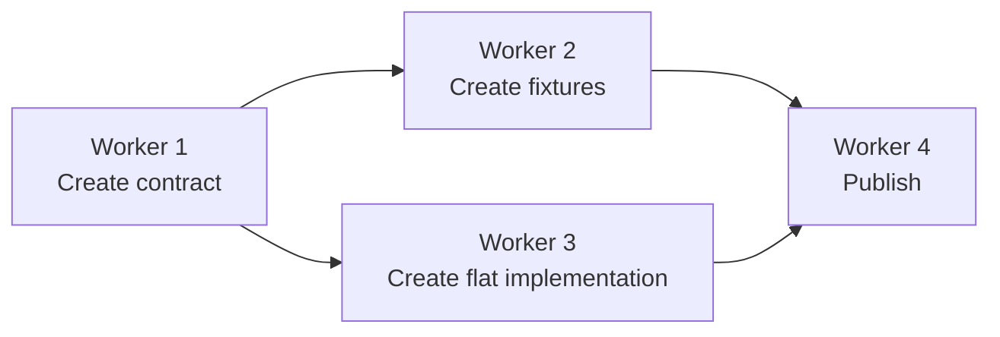
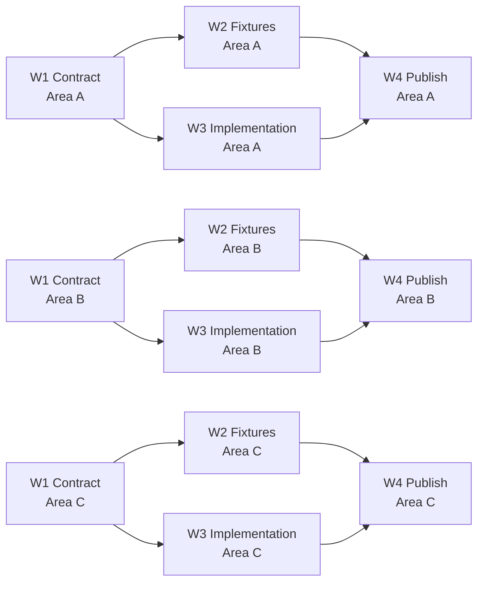
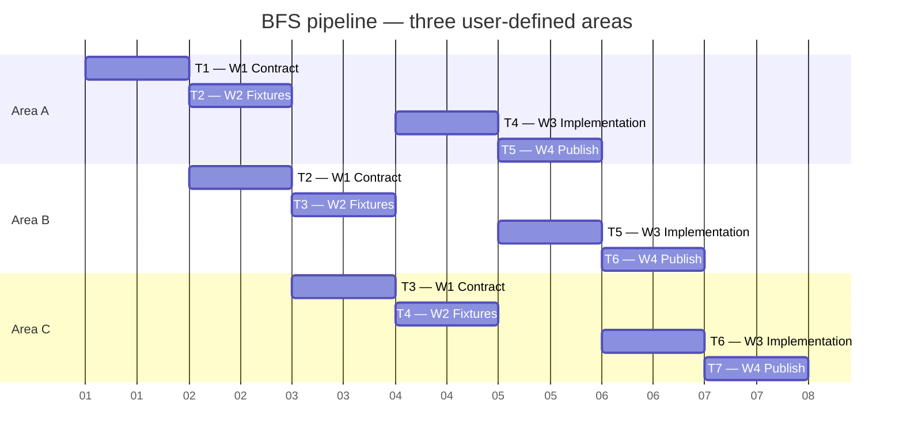

# Gantt Scheduling Algorithm

## Core Terms

A dependency diagram defines a reusable **workflow template**. A worker is one responsibility in that template; it is not a Gantt task by itself.

An **area** is the user-defined axis used to partition an orchestration flow. It may represent journeys, scenarios, organisms, application surfaces, audit scopes, or another user-defined grouping. The scheduler MUST NOT assume what an area represents or rename it.

A **task instance** is one worker applied to one area:

```text
Worker: W1 — Contract
Area: Journey A
Task instance: W1 — Contract (Journey A)
```

`T1`, `T2`, and so on are discrete time-unit labels. They are not task names.

The same workflow may be instantiated for any number of areas. `W1 — Contract (Journey A)` and `W1 — Contract (Journey B)` are separate task instances, even though they belong to the same worker.

## Eligibility

- A task instance is eligible only when every predecessor instance for the same area is complete.
- A task instance with a global prerequisite is eligible only when that prerequisite is complete.
- The orchestrator builds task instances from the dependency template and user-defined areas. Workers do not create or manage the schedule.

## Breadth-First Scheduling

Breadth-first search (BFS) here traverses **task instances**, not worker names. It expands the dependency template across the user-defined areas while preserving worker availability and upstream priority.

1. Instantiate the dependency template once for each area, preserving the user's area order.
2. Begin with the eligible root task for the first area.
3. For each later time unit, prioritize the earliest upstream worker responsibility that still has an undispatched eligible instance in the user-defined area order.
4. A worker MUST NOT receive two uncollapsed task instances in the same time unit. An ordinary time unit may therefore contain only one task when no eligible task from a different worker can fill the other slot.
5. When a second slot is available, fill it with an eligible task instance owned by a different worker. Prefer the earliest eligible worker responsibility and then the user-defined area order.
6. Continue this pipeline so upstream workers unlock every area before lower-priority downstream work consumes the available worker slots.
7. Do not advance from `Tn` to `Tn + 1` until all normally scheduled work in `Tn` is complete and the user authorizes continuation.

For example, if `W1` unlocks `W2` and `W3` for every area, the normal pipeline begins:

```text
T1: W1 — Contract (Area A)
T2: W2 — Fixtures (Area A)        | W1 — Contract (Area B)
T3: W2 — Fixtures (Area B)        | W1 — Contract (Area C)
T4: W3 — Implementation (Area A)  | W2 — Fixtures (Area C)
```

This keeps `W1` moving through the remaining areas instead of scheduling `W1` twice in one time unit or prematurely prioritizing a deeper task such as `W3 — Implementation (Area A)`.

## User-Authorized Visual Collapse

Only when the user explicitly authorizes a collapse, the Gantt MAY place multiple task instances of the same worker in the same displayed time unit:

```text
T8: W7 — Integration (Area A)
    W7 — Integration (Area B)
    W7 — Integration (Area C)
```

This is a visual grouping exception. It does not merge task instances, alter the areas, modify dependency edges, or create parallel workers. Each displayed entry remains `worker × area`, and the worker remains one execution responsibility.

## Dependency Template Example



For the user-defined areas `Area A`, `Area B`, and `Area C`, this creates separate task instances while preserving each area's dependencies:



## BFS Gantt Example



The schedule preserves the area axis, avoids two normal W1 instances in one time unit, and keeps upstream worker responsibilities moving across pending areas before deeper eligible work is selected.
